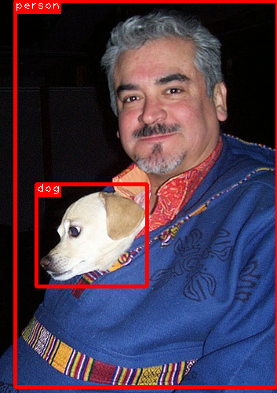

# SSD: Single Shot MultiBox Detector

This is an implementation of SSD (Single Shot MultiBox Detector) using Chainer

## Requirement

- Python 3.5+
- [Chainer](https://github.com/pfnet/chainer) 1.20+
    - DilatedConvolution2D is required.
- OpenCV 3

## Usage

### Testing

#### 1\. Download pre-traind Caffe model from https://github.com/weiliu89/caffe/tree/ssd#models
```
$ curl -LO http://www.cs.unc.edu/%7Ewliu/projects/SSD/models_VGGNet_VOC0712_SSD_300x300.tar.gz
$ tar xf models_VGGNet_VOC0712_SSD_300x300.tar.gz
```

#### 2\. Convert weights
```
$ python3 convert_caffe.py models/VGGNet/VOC0712/SSD_300x300/VGG_VOC0712_SSD_300x300_iter_120000.caffemodel ssd300.npz
```

#### 3\.a Test with VOC dataset
```
$ curl -LO http://host.robots.ox.ac.uk/pascal/VOC/voc2007/VOCtest_06-Nov-2007.tar
$ tar xf VOCtest_06-Nov-2007.tar
$ python3 test.py ssd300.npz --test 2007-test [--gpu gpu]
(comp4_det_test_*.txt will be generated)
```
In my experiment, the mAP was 77.5%.  
cf. the mAP of the original implementation was 77.6%.

#### 3\.b Test with an image
```
$ python3 predict.py ssd300.npz VOCdevkit/VOC2007/JPEGImages/000001.jpg
5 0.0130746 273 86 293 167
5 0.0113749 140 208 195 261
9 0.0211564 82 444 117 484
9 0.0200858 3 27 343 492
...
15 0.985803 12 5 354 492
15 0.0196945 273 95 294 173
15 0.013401 274 92 319 184
18 0.0143461 11 1 350 498
(press 'q' to exit)
```


### Training (on going)

#### 1\. Download pre-trained VGG16 model (fc reduced) from https://gist.github.com/weiliu89/2ed6e13bfd5b57cf81d6
```
$ curl -LO http://cs.unc.edu/~wliu/projects/ParseNet/VGG_ILSVRC_16_layers_fc_reduced.caffemodel
```

#### 2\. Convert weights
```
$ python3 convert_caffe.py --baseonly VGG_ILSVRC_16_layers_fc_reduced.caffemodel vgg16.npz
```

#### 3\. Download VOC dataset
```
$ curl -LO http://host.robots.ox.ac.uk/pascal/VOC/voc2007/VOCtrainval_06-Nov-2007.tar
$ curl -LO http://host.robots.ox.ac.uk/pascal/VOC/voc2012/VOCtrainval_11-May-2012.tar
$ tar xf VOCtrainval_06-Nov-2007.tar
$ tar xf VOCtrainval_11-May-2012.tar
```

#### 4\. Train
```
$ python3 train.py --init vgg16.npz --train 2007-trainval --train 2012-trainval [--gpu gpu]
```

## ToDo
- Fix the bug that the loss diverges
- Add data augmentation
- Evaluate trained models

## References
+ Liu, Wei, et al. "SSD: Single shot multibox detector." ECCV2016.
+ [Original implementation](https://github.com/weiliu89/caffe/tree/ssd)
