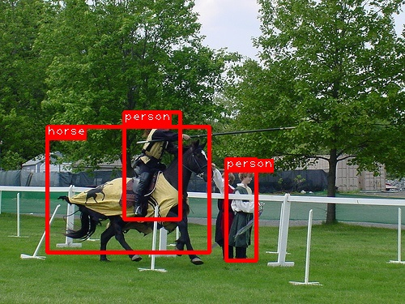

# SSD: Single Shot MultiBox Detector

This is an implementation of SSD (Single Shot MultiBox Detector) using Chainer

## Requirement

- Python 3.5+
- [Chainer](https://github.com/pfnet/chainer) 1.20+
    - DilatedConvolution2D is required.
- OpenCV 3

## Usage
### Testing
#### 1\. Download pre-traind Caffe model from (https://github.com/weiliu89/caffe/tree/ssd#models)
```
curl -LO http://www.cs.unc.edu/%7Ewliu/projects/SSD/models_VGGNet_VOC0712Plus_SSD_300x300.tar.gz
tar xf models_VGGNet_VOC0712Plus_SSD_300x300.tar.gz
```
#### 2\. Convert weights
```
./convert_caffe.py models/VGGNet/VOC0712Plus/SSD_300x300/VGG_VOC0712Plus_SSD_300x300_iter_240000.caffemodel ssd300.npz
```
#### 3\. Predict
```
./predict.py ssd300.npz image.jpg
```


## References
+ Liu, Wei, et al. "SSD: Single shot multibox detector." ECCV2016.
+ [Original implementation](https://github.com/weiliu89/caffe/tree/ssd)
