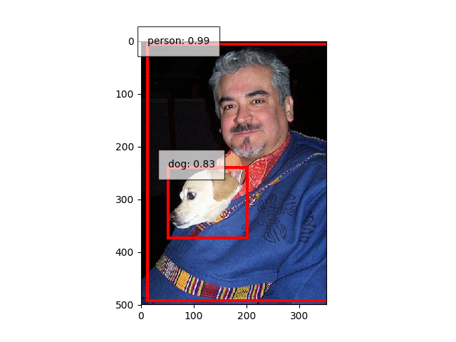

***This repository is not maintained and some bugs are found in training code. Please use [ChainerCV](https://github.com/chainer/chainercv/).***

# SSD: Single Shot MultiBox Detector

This is an implementation of SSD (Single Shot MultiBox Detector) using Chainer

## Performance
Pascal VOC2007 Test

| Method | Original | Test only (model conversion) | Train and Test |
|:-:|:-:|:-:|:-:|
| SSD300 | 77.6 % | 77.5 % | 77.3 % |
| SSD512 | 79.5 % [3] | 79.6 % | - |

## Requirements

- Python 3.5+
- [Chainer](https://github.com/pfnet/chainer) 1.24+
    - `ExponentialShift` had a resuming issue in older version.
- OpenCV 3
- Matplotlib

## Usage

### Testing

#### 1\. Download pre-traind Caffe model from https://github.com/weiliu89/caffe/tree/ssd#models
```
$ curl -LO http://www.cs.unc.edu/%7Ewliu/projects/SSD/models_VGGNet_VOC0712_SSD_300x300.tar.gz
$ tar xf models_VGGNet_VOC0712_SSD_300x300.tar.gz
```

#### 2\. Convert weights
```
$ ./caffe2npz.py models/VGGNet/VOC0712/SSD_300x300/VGG_VOC0712_SSD_300x300_iter_120000.caffemodel VGG_VOC0712_SSD_300.npz
```

#### 3\.a Test with Pascal VOC dataset
```
$ curl -LO http://host.robots.ox.ac.uk/pascal/VOC/voc2007/VOCtest_06-Nov-2007.tar
$ tar xf VOCtest_06-Nov-2007.tar
$ ./test.py [--arch 300] VGG_VOC0712_SSD_300.npz 2007-test [--gpu gpu]
(result/comp4_det_test_*.txt will be generated)
```

#### 3\.b Test with an image
```
$ ./demo.py [--arch 300] VGG_VOC0712_SSD_300.npz VOCdevkit/VOC2007/JPEGImages/000001.jpg
5 0.0130746 273 86 293 167
5 0.0113751 140 208 195 261
9 0.0211564 82 444 117 484
9 0.0200858 3 27 343 492
9 0.0164014 68 446 97 486
9 0.0158782 59 425 131 488
9 0.0157032 128 455 187 488
9 0.0131429 8 335 63 427
12 0.82896 51 240 202 374
12 0.147764 8 227 237 476
12 0.0550958 11 1 350 498
15 0.985803 12 5 354 492
15 0.0196945 273 95 294 173
15 0.0134011 274 92 319 184
18 0.0143462 11 1 350 498
```


### Training

#### 1\. Download pre-trained VGG16 model (fc reduced) from https://gist.github.com/weiliu89/2ed6e13bfd5b57cf81d6
```
$ curl -LO http://cs.unc.edu/~wliu/projects/ParseNet/VGG_ILSVRC_16_layers_fc_reduced.caffemodel
```

#### 2\. Convert weights
```
$ ./caffe2npz.py VGG_ILSVRC_16_layers_fc_reduced.caffemodel VGG_ILSVRC_16_fc_reduced.npz
```

#### 3\. Download VOC dataset
```
$ curl -LO http://host.robots.ox.ac.uk/pascal/VOC/voc2007/VOCtrainval_06-Nov-2007.tar
$ curl -LO http://host.robots.ox.ac.uk/pascal/VOC/voc2012/VOCtrainval_11-May-2012.tar
$ tar xf VOCtrainval_06-Nov-2007.tar
$ tar xf VOCtrainval_11-May-2012.tar
```

#### 4\. Train
```
$ ./train.py --init VGG_ILSVRC_16_fc_reduced.npz --train 2007-trainval --train 2012-trainval [--gpu gpu]
```


## ToDo
- Multi GPUs support

## References
- [1]: Wei Liu, et al. "SSD: Single shot multibox detector" ECCV 2016.
- [2]: [Original implementation](https://github.com/weiliu89/caffe/tree/ssd)
- [3]: Cheng-Yang Fu, et al. "[DSSD : Deconvolutional Single Shot Detector](https://arxiv.org/abs/1701.06659)" arXiv 2017.
